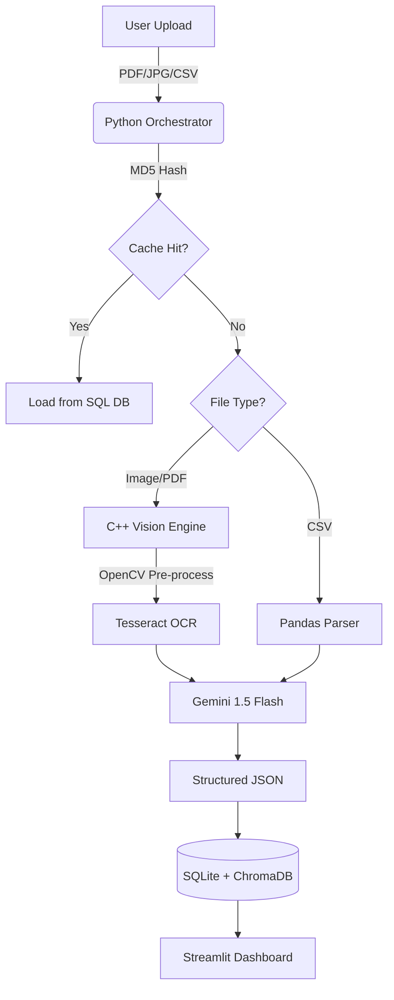

# DocAnalyzer Pro (Enterprise Edition) 🚀

**High-Performance Document Intelligence Platform by Xentro AI**

  

DocAnalyzer Pro is a **hybrid AI platform** designed to automate complex financial document processing. Unlike standard wrappers, it uses a **custom-compiled C++ Vision Engine** to pre-process low-quality images (deskewing, binarization, upscaling) before routing data to a **Retrieval-Augmented Generation (RAG)** pipeline for semantic analysis.

---

## ⚡ Deep Core Technology

### 1. 🧠 The C++ Vision Engine (`docproc`)
We do not rely on Python for heavy image processing. The core engine is written in **C++17** using **OpenCV** and **Tesseract 5**.
* **"Super-Resolution" Pipeline:** Automatically upscales low-res receipt photos (36KB) by 300% using bicubic interpolation.
* **Heuristic Rotation Logic:** Solves the "rotated text" problem by testing 4 orientation vectors (0°, 90°, 180°, 270°) and selecting the optimal angle based on OCR confidence scores.
* **Adaptive Thresholding:** Uses local block analysis to remove shadows and wood-grain backgrounds from camera photos.

### 2. 🛡️ Enterprise Architecture
The system follows a strict **Vertical Slice Architecture**:
* **Orchestrator:** Python subprocess management with timeout handling and memory leak prevention.
* **Dual-Database System:**
    * **SQL (SQLite):** Transactional records, file hashing (MD5), and batch history.
    * **Vector Store (ChromaDB):** Semantic embeddings for the "Chat with Data" feature.
* **Context Isolation:** Strict RAG filtering ensures the AI answers questions *only* about the active document, preventing data leakage between clients.

### 3. 🎨 "Neural HUD" Interface
A custom-built reactive UI on top of Streamlit:
* **Dynamic Theme Engine:** Hot-swaps CSS variables for Neon Dark Mode / Corporate Light Mode.
* **Visual Debugging:** Exposes the raw C++ computer vision output ("CEO Vision") to build user trust.
* **Batch Telemetry:** Aggregates financial totals across hundreds of documents in real-time.

---

## 🏗️ Architecture Diagram



---

## 🚀 Features at a Glance

| Feature | Capability |
| :--- | :--- |
| **Batch Processing** | Drag & drop 50+ files; auto-loops and aggregates totals. |
| **Smart Renaming** | Renames `scan_001.jpg` → `2025-11-24_HotelNewYork_Receipt.jpg`. |
| **Financial Trends** | Interactive Altair charts showing spending by Vendor vs. Date. |
| **Confidence Heatmap** | Color-coded table rows (Green/Red) based on AI certainty. |
| **Auto-Correction** | Built-in Data Editor allows humans to fix OCR errors before export. |

### Core Processing (v2)
| Feature | Capability |
| :--- | :--- |
| **Hybrid C++ Engine** | Custom OpenCV pipeline for deskewing & upscaling receipt photos. |
| **Batch Processing** | Parallel processing of 50+ mixed documents (PDF/JPG/CSV). |
| **Smart Renaming** | Auto-renames files: `scan_001.jpg` → `2025-11-24_Vendor_Invoice.jpg`. |

### Enterprise Intelligence (v3) 🆕
| Feature | Capability |
| :--- | :--- |
| **🛡️ Anomaly Auditor** | **Fraud Detection:** Flags invoices with >40% price deviation or unknown vendors against historical data. |
| **🌍 Global Brain** | **Cross-Doc Intelligence:** Ask questions across your entire database (e.g., "Total spend on Microsoft last year?"). |
| **🔒 Privacy Vault** | **GDPR Compliance:** Auto-redacts PII (Names, Phones) from JSON exports for safe sharing. |
| **📊 Financial Analytics** | Interactive charts showing spending trends by Vendor and Time. |

---

## 🛠️ Installation & Setup

### Prerequisites
* Linux/Mac (or WSL2 on Windows)
* C++ Compiler (`g++` or `clang`)
* Python 3.10+
* Tesseract & OpenCV libraries

### 1. Clone & Build

```bash
git clone https://github.com/xentro-ai/docanalyzer-pro.git
cd docanalyzer-pro

# Build the C++ Engine
mkdir build && cd build
cmake .. && make
cd ..
```

### 2. Install Dependencies

```bash
pip install -r requirements.txt
```

### 3. Run the Platform

```bash
streamlit run src/python/app.py
```

---

## 🔮 Future Roadmap (v3.0)

* [ ] **Docker Containerization:** Deploy as a microservice container.
* [ ] **API Endpoint:** Expose `FastAPI` routes for external integrations.
* [ ] **Local LLM Fallback:** Support for `DeepSeek-Coder` when offline.

---

**Built with ❤️ by Xentro AI**
*Hybrid Automation Experts*